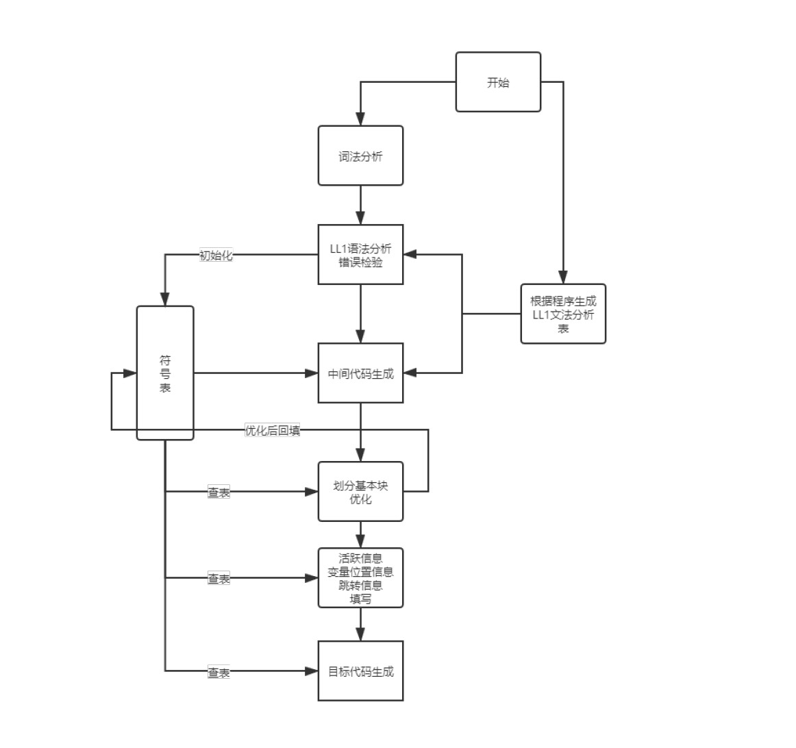

# CompilerProject
NEU编译原理课设基于LL1文法，实现类C语言代码到汇编代码的生成

最终展示是用Django搭建的网站形式，本仓库不包含网页代码。

[网站链接](https://justyan.top/compiler/index)

ps:网站对输入没有严格的检测，所以随便输入可能会导致卡死😂，最好使用示例代码，或者基于下面的介绍修改。

网站使用时可以输入此文件[c_input](c_input)中的示例代码尝试，也可以根据本项目定义的文法使用。

网站功能，最上方是代码输入框，符号表，下一层是汇编代码，未优化的四元式，优化后的四元式。

## 程序运行流程：

+ 词法分析，使用类似自动机的形式循环读入判断。
+ 语法分析，首先定义了一整套符合LL1的文法规则在[c_like_grammar](grammar_static/c_like_grammar)中，然后通过LL1分析表的求解方法，实现了自动first集，follow集，select集，得到分析表，并保存成json格式，避免每次编译都重新计算。
+ 语法分析过程进行符号表的填写，同时检查变量定义，语法错误等问题并进行定位。抛出异常。
+ 符号表主要分结构体表，函数表，变量表。变量重复定义未定义检测的方法都定义在符号表中，语法错误检测的方法定义在语法分析中。
+ 确认语法没有问题后进行四元式的生产，这部分同样基于LL1并且基于之前的文法规则定义了翻译文法。其中的流程算法和语法分析基本一致
+ 对生产的四元式进行切块，每块进行优化
+ 对优化和的四元式的每一块进行目标代码生成。目标代码生成部分首先填写活跃信息，内存分配即地址填写，这部分与符号表的内容强关联。



## 主要功能

1. 支持类型：
    + 整形，初始化与赋值需要分开 
        + `int a;`
        + `a=10;`
    + 整形数组,不支持定义时赋值
        + `int a[10];`
        + `a[0]=10`;
    + 结构体，结构体中可包含整形，整形数组，具体结构体如何定义查看 [c_like_grammar](grammar_static/c_like_grammar)
        + ```
          struct Demo{
            int id[10];
            int gpa;
          };
          ```
2. 支持`while`循环,`if else/elif`判断，并且可互相嵌套，汇编代码生成部分对嵌套的作用域的处理还存在一些问题
    + ```
      while(d<10){
        d=d+1;
        if(d>0){
        d=d-10;
        continue;
        }
        d=d-2;
        d=d-3;
        }
      ```
3. 支持函数定义调用，参数传递在数组和结构体时默认传递地址
4. 报错功能，对重复定义，未定义调用，符号错误如缺少分号的情况等可以定位到具体的行号。
    + 具体的操作可以在网页中输入示例代码，然后删除某个括号，分号之类的标识符或者是使用未定义的变量，点击编译，会弹窗显示错误类型和行号（目前行号可能存在一两行的偏差）。
5. 每个函数块是一个独立的作用域

## 主要文件
+ `lexer.py` 生成token序列，识别非法字符
+ `grammarParaser.py`前端处理最核心部分，实现了LL1文法的判断，LL1分析表的生成。后面的语法分析四元式都继承自这里面实现的类
+ `grammar.py` 语法分析 LL1自顶向下分析
    + 语法分析过程中进行变量冲突检测
    + 分析成功后将代码按照函数分块送入四元式生成函数
    + 最后拼接生成的四元式
+ `qt_gen.py` 四元式生成，输入的是一个函数块，在其内部再进行更小块的切分分别生成四元式
+ `asm_gen_x.py`后端汇编代码生成部分都集中在这个文件中。

## 部分时间线（不完全） 
+ 2019-12-12
    + 把LL1中的分析表用json格式的文件存储，每次调用直接从文件读取无需计算
    + 语法分析部分的工作基本完成，变量重复定义，未定义检验，函数调用部分未检验
+ 2019-12-13
    + 对函数调用的时候的参数个数进行检测，添加报错信息
    + 函数到四元式的转换
    + 四元式中添加变量的活跃信息
    + 函数调用部分转四元式
    + 返回信息转四元式
+ 2019-12-18
    + 四元式转目标代码
    + 目标代码跳转信息填写


## 文件介绍：
+ `lexer.py` 词法分析，生成token序列，这里要对token序列做好方便扩展，后边报错可以定位到行就是依赖这部分token序列中的信息。
+ `grammarParaser.py` 生成LL1分析表,计算first集，follow集，select集
+ `grammar.py` LL1语法分析过程，通过生成的LL1分析表进行操作，同时填写符号表，产生报错信息（这部分其实应该单独写一个类用来处理报错信息会好一些）
+ `grammar_static` 文件夹保存语法分析的相关文件，包括文法定义，分析表的存储。
+ `symbol_table.py` 符号表的结构定义，内部实现元素定义问题的报错功能
+ `qt_gen.py` 四元式生成，基本实现流程和LL1于分分析类似，不同的是使用的是翻译文法，LL1分析表不需要改变。
+ `optimization.py` 四元式划分基本块，对基本快进行DAG优化
+ `asm_gen_x.py` 目标代码生成
  + 计算活跃信息，位置信息
  + 生成汇编代码过程中添加跳转信息
  + 这里面的功能比较冗杂应该可以再拆分成两部分
+ `clikercompiler.py` 程序入口
+ 基本每个文件都可以单独运行，但是都会向前依赖。


## 小总结
+ 从实验的开始的时候就开始准备核心部分的代码，最后发现实验的文法规则很简单那部分代码没有报错，当实际写了那种几十行的文法的时候想完全依靠代码判断文法的正确性，却发现错误一堆，各种边界问题，不过好在也都修改对了，整个项目里写的最好的一块大概就是LL1分析表生成那部分。
+ 数据结构的设计，流程一定想好了再写代码，不然一定会推倒重来的，符号表与语法分析的联系，大概推倒重写了两三次，最后一部分的汇编代码生成就是时间不太够，不然真的得推倒再写一遍，结构太乱了。


## 最后
+ 生成汇编代码存在类似伪代码的部分还无法运行
+ 此项目仅供参考，请勿直接使用


